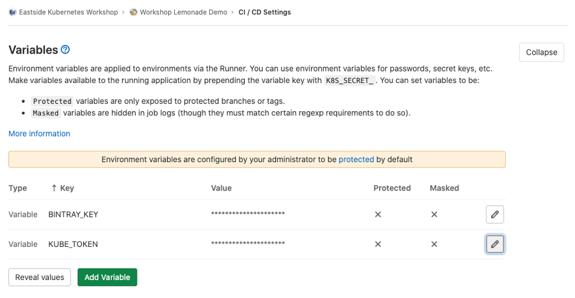
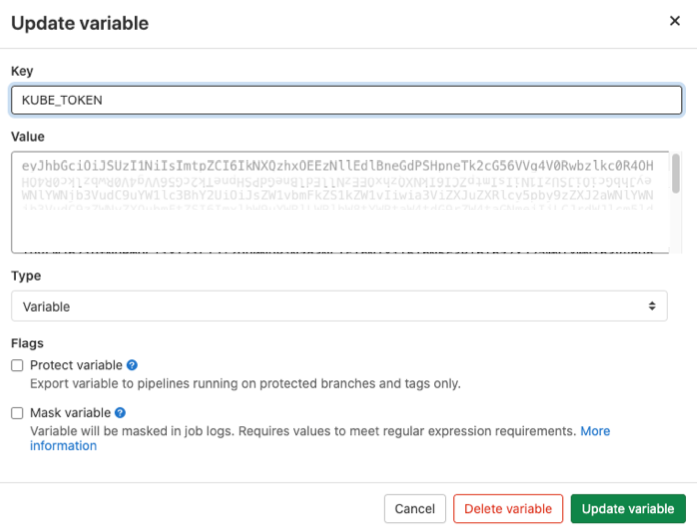

# Create a cluster for your demo

Use your cloud provider to setup a cluster. `GettingStarted.md` has the
instructions getting `kubectl` to talk with your cluster.

```
kubectl version
```

# Namespace

Next setup a namespace. This is a good first step for all environments. All
deployments and applications should use a specified namespace, even for very
small, single purpose clusters.

The namespace is created by applying the namespace yaml file. 

```
kubectl get namespace
kubectl apply -f lemonade-demo-namespace.yaml 
kubectl get namespace
```

The first command lists all namespaces. The second one creates the namespace
we will use to scope our work on the cluster. Finally we check the list of
namespaces just to demonstrate that we have properly created our demo
namespace.

# Set your defaut context

This demonstraction uses the `lemonade-demo` namespace throughout. It
becomes tiresome to repeat the `-n lemonade-demo` flag again and
again. To avoid this repetition we can set the namespace in our
current context:

```
kubectl config get-contexts
kubectl config  set-context  --current --namespace lemonade-demo
kubectl config get-contexts
```

# Create Service Account

Next we create a service account which is use for our application deployments.
This service account is scoped to the demo namespace. This is why immediatly
create a namespace. As you deploy to a cluster, you may deploy test or 
experimental versions of an application. Having a namespace at the start
allows you to separate these experiements, or applications, or teams
from each other. 

```
kubectl get -n lemonade-demo serviceaccount
kubectl apply -n lemonade-demo -f lemonade-demo-admin.yaml
kubectl get -n lemonade-demo serviceaccount
```

This will create a service account an also an associated secret. The secret
will be used later to authenticate to the cluster as this service account.

You can see that a secret was created with:

```
kubectl get -n lemonade-demo serviceaccount lemonade-demo-admin -o yaml
```

# Create a Role Binding

Now we need provide the above service account with permissions so it is
allowed to perform actions. We are take a shortcut here and providing this
account full admin permissions to this namespace. This is a bit much. However,
an admin account will be used in a namespace by developers. We are just
re-purposing this account for deployments, for now.

The following creates a role binding, which is a mapping from an account to
a role.

`Service account` <-- 1 to many -> `Role Binding` <- many to 1 -> `Role`

For most Role Bindings we have to create a Role first, but in this case we
are using the Cluster Admin roles that already exists. And because this 
Role Binding is created in the `lemonade-demo` namespace, this account can
only manipulate resources in this namespace. (Note also, that things like
Nodes and Cluster Roles don't exist in any namespace that cannot be
manipulated by this admin role. Only things like Pods and Deployments can be
modified.)

```
kubectl get rolebinding -n lemonade-demo
kubectl create rolebinding -n lemonade-demo lemonade-demo-admin-rb --clusterrole admin
kubectl apply -n lemonade-demo -f lemonade-demo-admin-rb.yaml
kubectl get rolebinding -n lemonade-demo
```

The newly creqted Role Binding can be inspected via:

```
kubectl get rolebinding -n lemonade-demo lemonade-demo-admin-rb -o yaml
```

So inside the namespace `lemonade-demo` a role binding called `lemonade-demo-rb`
is created for the service account named `lemonade-demo-admin`.

# Deployment Token

Next we need to find the secret token for the service above to use to deploy 
our projects to the cluster. 

First we find the name of the token by displaying the complete service account
definiition with:

```
kubectl get -n lemonade-demo serviceaccount lemonade-demo-admin -o yaml
```

Near the bottom of of the yaml you will this stanza which shows the name 
of the created secret:

```
    . . .
secrets:
- name: lemonade-demo-admin-token-<random-suffix>
```

Now we need to display this token

```
kubectl get secret -n lemonade-demo lemonade-demo-admin-token-<random-suffix>
kubectl get secret -n lemonade-demo lemonade-demo-admin-token-<random-suffix> -o yaml
```

In the `token` field is the secret we want, but it's base 64 encoded, so it
needs to be decoded. You can copy / paste that string to a decoder, or use 
this ball-of-fur command:

```
kubectl get secrets -n lemonade-demo lemonade-demo-admin-token-<random-suffix> -o json | jq -r '.data.token' | base64 -D ; echo 
```

That will display a long string of about 1,000 characters. This long string
is copied into your GitLab CI/CD settings as the value for a variable
we call `KUBE_TOKEN`, into the GitLab group you created to hold your
demo projects. 

If you put the `KUBE_TOKEN` in the CI/CD settings for the group, this
value will be available to all the projects in that group. This is
extremely convenient, and saves setting up a lot of redudant CI/CD variables.

This is shown in GitLab CI/CD Settings below:



Either add the variable for `KUBE_TOKEN` or update the existing value
as shown below:




# Ensure the current repository has a kub config file

```
kubectl config view --minify --raw > k8s/config
```


