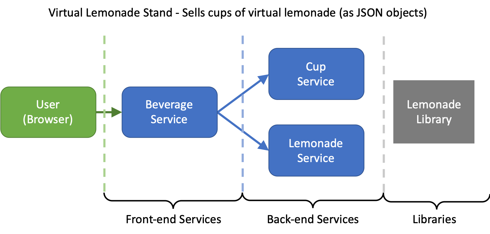

```
Copyright 2019 Eastside Kubernetes Workshop

   Licensed under the Apache License, Version 2.0 (the "License");
   you may not use this file except in compliance with the License.

See: https://gitlab.com/eastside-kubernetes-workshop/overview/blob/master/LICENSE
```

# Overview

This project describes all the projects in the Workshop Lemonade Demo group. 
This group is a part of the demonstration and tinkering code used in the
Eastside Kubernetes Workshop (See: https://gitlab.com/eastside-kubernetes-workshop)

Together, these projects demostrate a first, mostly real applicaiton service
ecosystem deployed on a Kubernetes cluster. It demos the following:

* A very simple application made up of three services
* Deployment files for Kubernetes
* CI/CD using GitLab Runners
* Building and deploying Docker artifacts

The sample application is designed to be dead-bang simple so we concentrate
on the Kuberentes scaffolding and not 
[12 factor application design patterns](https://12factor.net/).

# The System

The Lemonade Demo is a set of microservices which "serve" 
virtual servings of lemonade or other beverages. The servings
are really just JSON messages passed back to a front end
(which is optional, for simplicity). The system application
diagram:



# Tools you might need

The code and steps for code wrangling are found in the
[`GettingStarted.md`](GettingStarted.md) document.

# The Basic Demonstration

The following are steps for walking through the demonstration

## Create a group to hold the projects

This demonstration uses several repositories for different
pieces. This project is a poly-repo or multi-repo approach to
microservices. (The other approach woudl be a mono-repo).

On the GitLab top menu click on `Groups`, then choose `Your Groups`.
Next, on the right hand side should be a green button for `New Group`.
Fill in the information and click on `Create Group`

## Fork the Cup Supply service to your GitLab account

Eventully you will fork/copy all four (five, if you include this
Overview project) to the new group in your account. 

Start with the `cup-supply` serivce. For directions see the
[`ForkCupSupply.md`](ForkCupSupply.md) document.

## Create a Kubernetes cluster and setup the namespace

Create a cluster on your favorite cloud provider. A default cluster provided
by Google or Azure will work. These probably default to 3 small nodes, and
that enough for the demo. This default costs about $3 per day, way less if 
you only run it for the few hours to walk through this demo.

For instructions see the [`ClusterSetup.md`](ClusterSetup.md)  document.

## Setup Secrets so that Cup Supply will deploy

When you forked CupSupply, GitLab's CI/CD tool ran, built and packaged your
project. But it should have failed the deploy step. By setting the 
Cluster Secrets in GitLab CI/CD varaibles we can allow this deployment 
to succeed.

For instructions see the [`DeployCupSupply.md`](DeployCupSupply.md) document.

## Fork and Deploy Lemonade Service

Yep, cups need to be filled with something refreshing. This service is the 
source of that virtual tasty lemonade.

For instructions see the [`DeployLemonadeSupply.md`](DeployLemonadeSupply.md) document.

## Fork and Deploy the Beverage Service

The Beverage service completes the service ecosystem.

For instructions see the [`DeployBeverageService.md`](DeployBeverageService.md) document.

## Deploy Promethesus for monitoring

If you are responsible for a system, you must have monitoring. Setting up
Prometheus is can be pretty straight forward, even if there is a list
of details to attend to.

For instructions see the [`InstallPrometheus.md`](InstallPrometheus.md)
document.


