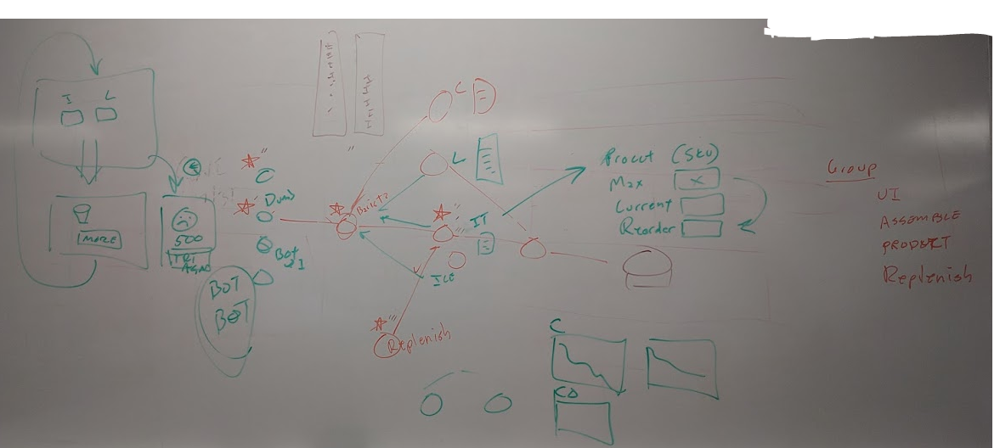

# Overview
This project is a learning project and demonstration of several technologies
for building cloud native applications in a DevOps manner. The application
under development is not overly complex but service to illustrate some
interesting issues with layered services, monitoring and with reactive
web design. 

# Subject Application 
The subject application simulates a lemonade stand serving thirsty customers 
at a beach-front boardwalk kiosk on a hot day at the beach using services 
that provide lemonade, ice tea, ice cubes and cups.

The sketch of the design looks like this:  
  

This sketch is hard to read, and will be replaced with a better diagram, but 
we don't want to lose the mojo for now.

# Components
The application consists of a UI which will show the product (virtual product,
lemonade or ice tea with ice cubes in cups) being produced. This UI will be
continuously updated showing the produced product.

The UI service connects to the back end barista / assembly service. This service
assembles the final (virtual) product from the component services. This service
requests the individual pieces used to build the serving of delicious beverage. 
It is envision the serving will be delivered in a cup from the cup componet service. 
The cup is filled with a beverage, either lemonade or ice tea, from one or
more beverage comoponet services. I.e. an Arnold Palmer beverage could be
created by requesting a half serving of lemonade and ice tea. Finally, since
the beverage is to be consume on a hot day on the beach boardwalk, a cup is
obtained from the cup component service. 

It imagined that the the component services will have details about how much
product they hold, and when providing product upstream will decrment the inventory.
If the inventory drops to zero, the services cannot deliver product. So there is
a replenishment service which will provide new inventory to the component
service. In some cases, the replishment is very quick, putting cups on a
shelf. In some cases, brewing a new pot of tea, the replenishment may take
some time. This may necessitate that the system run two ice tea services
(not like a distributed service, but like a second brewing station for 
product.)

# Technical Details
The initial MVP be delivered quickly, but will be modified incrementally 
to include distributed tracing so that difficulties in the system operation
can be quickly traced to the root cause. In systems with complex service
dependencies, failures in one component can be hard to find. This exmaple
is not overly complex, but interesting enough to explore how business
metrics (inventory, sales), technical metrics (cpu, memory) and 
instrumentation/tracing work together.

